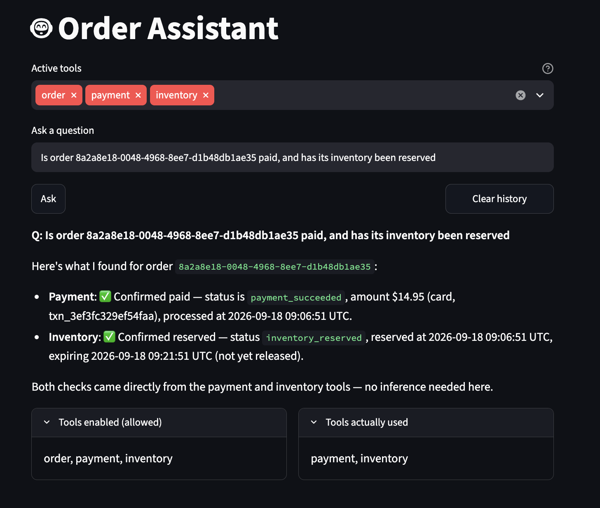
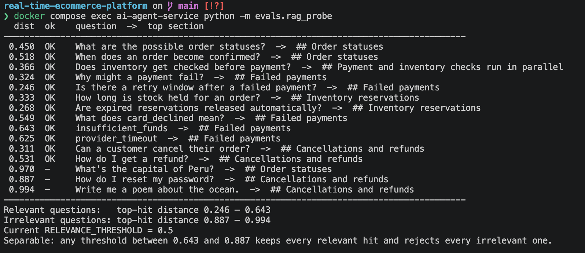

# Real-Time E-Commerce Data Platform

An event-driven e-commerce backend: orders flow through Kafka to independent
payment, inventory, and notification services, land in a data lake, and can be
queried in plain language by an AI agent that reads live service data and
internal documentation.

Built with Python, FastAPI, PostgreSQL, Apache Kafka, Docker, LangGraph, and
(in progress) Terraform on AWS.

```bash
git clone <this-repo> && cd real-time-ecommerce-platform
cp services/order-service/.env.example services/order-service/.env
cp services/ai-agent-service/.env.example services/ai-agent-service/.env  # add ANTHROPIC_API_KEY
make up
```

Everything runs locally in Docker — no AWS account or cloud costs needed.



## What it demonstrates

- **Event-driven microservices** — six services communicating only through
  Kafka events, never by reaching into each other's databases.
- **Transactional outbox pattern** — guarantees an order and its event are
  never out of sync, without distributed transactions.
- **Choreography saga** — payment and inventory resolve independently and in
  parallel; the order's final status is derived from both.
- **Kafka in KRaft mode** — no Zookeeper, with explicitly provisioned topics.
- **Stream ingestion to a data lake** — every event archived, partitioned by
  topic and date, pluggable between local disk and S3.
- **AI agent with tool use** — a LangGraph agent that answers questions by
  calling the platform's own APIs, with per-request control over which tools
  it may use.
- **RAG over internal docs** — pgvector semantic search with a retrieval
  threshold set from measurement, not guesswork.
- **Testing and evaluation** — 28 automated tests plus an eval harness that
  checks the agent's tool choices and guardrail behavior.

## Verified behavior

Claims worth checking rather than taking on faith:

| What was tested | Result |
|---|---|
| Order/outbox atomicity under load (900+ orders via a synthetic traffic generator) | Exact 1:1 match, zero divergence |
| End-to-end event delivery, reconciled by order ID across every Kafka topic | Zero missing orders |
| Order status consolidation under continuous load | 114/114 orders reached a correct terminal state |
| Automated tests (chunking, ingestion, search failure modes) | 28 passing in ~1.3s |
| RAG retrieval quality (15 probe questions) | Relevant 0.25–0.64, irrelevant 0.89–0.99 — cleanly separable |

Retrieval quality is measured rather than assumed. This probe run showed the
initial threshold of `0.5` would have silently rejected five correct
retrievals — including every bare-identifier lookup like `insufficient_funds`
— and that a clean gap separated relevant from irrelevant results. The
threshold was moved to `0.75` on that evidence:



```
$ python -m pytest tests/ -v
28 passed in 1.28s
```

## Architecture

```
                      CLIENT
                        │
                        ▼
                  ┌───────────┐
                  │  FastAPI  │
                  │ Order API │
                  └─────┬─────┘
                        │
                        ▼
                  ┌────────────┐
                  │ PostgreSQL │
                  │  Orders +  │
                  │  Outbox    │
                  └─────┬──────┘
                        │
                Transactional Outbox
                        │
                        ▼
                ┌───────────────┐
                │     Kafka     │
                │  (AWS MSK)    │
                └───────┬───────┘
                        │
            ┌───────────┼─────────────┐
            ▼           ▼             │
        Payment      Inventory        │
        Service       Service         │
            │           │             │
            └─────┬─────┘             │
                  ▼                   │
        order-service consolidates    │
        status, emits order-confirmed │
        / order-cancelled             │
                  │                   │
                  ▼                   │
          Notification Service ◄──────┘
                  │
                  ▼
           DATA PIPELINE
                  │
         ┌────────┴────────┐
         ▼                 ▼
      S3 Data Lake     Analytics DB
                            │
                            ▼
                     BI / Reporting

          ┌──────────────────────────┐
          │    AI Agent Service      │
          │   (LangGraph + Claude)   │◄── Streamlit UI
          │                          │
          │ tools: order, payment,   │
          │        inventory, RAG    │
          └───────────┬──────────────┘
                      │  HTTP (same APIs a human would call)
                      ▼
       order-service / payment-service / inventory-service
```

## Key design decisions

- **Transactional outbox, not dual writes** — `order-service` writes the order
  and its event to Postgres in one transaction; a background worker publishes
  from the outbox table to Kafka. This removes the failure mode where the
  database commit succeeds but the Kafka publish doesn't, without needing
  distributed transactions.
- **Polling publisher over Debezium/CDC** — keeps the pipeline explainable
  end-to-end without depending on Kafka Connect internals. The atomicity
  guarantee is identical; only the publish mechanism differs.
- **Fulfillment state kept out of the order entity** — payment and inventory
  results are tracked in a separate `order_fulfillment_state` table rather
  than as columns on `orders`, so coordination bookkeeping doesn't leak into
  the order's own schema. `order-service` derives the final status from it and
  emits one consolidated event, instead of leaving consumers to piece two raw
  events together.
- **At-least-once delivery, made explicit** — consumers commit offsets only
  after a successful write, so a crash can reprocess but never drop. Writes are
  idempotent (`ON CONFLICT`) to absorb the duplicates that implies.
- **Database per service** — each service owns its own Postgres instance; no
  service reads another's tables. Cross-service questions go through events, or
  through each service's HTTP API.
- **The AI agent has no database access** — it answers only by calling the same
  APIs a human could call. That's what makes "cite what you checked" an
  enforceable property rather than a prompt suggestion.
- **Retrieval threshold set by measurement** — an initial guess of 0.5 would
  have silently rejected five correct retrievals; probing the corpus showed a
  clean gap and moved it to 0.75.

## Status

🚧 Under active development.

| Component | Status |
|---|---|
| `order-service` — orders API, transactional outbox, status consolidation | ✅ Done, verified under load |
| `payment-service` — payment processing, persisted results, query API | ✅ Done |
| `inventory-service` — stock reservation, persisted results, query API | ✅ Done |
| `notification-service` — consumes consolidated order events | ✅ Done |
| `data-pipeline` — Kafka → local/S3 data lake | ✅ Done |
| `load-generator` — synthetic order traffic for load testing | ✅ Done |
| `ai-agent-service` — LangGraph agent, tool use, RAG, eval harness | ✅ Done |
| `agent-ui` — Streamlit front-end | ✅ Done |
| AI observability (LangSmith tracing) | ✅ Done |
| Terraform / AWS deployment | 🚧 In progress — networking layer |
| Analytics DB batch loader (lake → BI) | ⬜ Deferred |
| Inventory reservation auto-expiry | ⬜ Deferred (documented gap) |
| CI/CD | ⬜ Not started |
| Platform observability (metrics, dashboards, alerting) | ⬜ Not started |

## Repository layout

```
real-time-ecommerce-platform/
├── docker-compose.yml        # Postgres ×4, Kafka (KRaft), topic init, all services
├── Makefile                  # make up / down / logs / topics / load-gen
├── services/
│   ├── order-service/        # orders API, outbox publisher, status consolidation
│   ├── payment-service/      # Kafka consumer/producer + query API
│   ├── inventory-service/    # Kafka consumer/producer + query API
│   ├── notification-service/ # consumes order-confirmed / order-cancelled
│   ├── ai-agent-service/     # LangGraph agent, tools, RAG  (see its README)
│   └── agent-ui/             # Streamlit front-end
├── data-pipeline/            # Kafka → data lake
├── load-generator/           # synthetic order traffic
└── terraform/                # AWS deployment (in progress)
```

## Kafka topics

| Topic | Produced by | Consumed by |
|---|---|---|
| `order-created` | order-service (via outbox) | payment-service, inventory-service, data-pipeline |
| `payment-processed` | payment-service | order-service, data-pipeline |
| `inventory-reserved` | inventory-service | order-service, data-pipeline |
| `order-confirmed` | order-service | notification-service |
| `order-cancelled` | order-service | notification-service |

## Try it

After `make up`, create an order and watch it flow through every service:

```bash
curl -X POST http://localhost:8000/orders \
  -H "Content-Type: application/json" \
  -d '{"customer_id": "11111111-1111-1111-1111-111111111111", "total_amount": "49.99"}'

docker compose logs -f order-service payment-service inventory-service notification-service
```

Ask the AI agent about that order, at http://localhost:8501 or directly:

```bash
curl -X POST http://localhost:8010/agent/ask \
  -H "Content-Type: application/json" \
  -d '{"question": "What is the status of order <id>?", "enabled_tools": ["order"]}'
```

Generate continuous traffic, then check nothing was lost:

```bash
make load-gen RATE=2
docker compose exec order-postgres psql -U postgres -d orders \
  -c "SELECT status, count(*) FROM orders GROUP BY status;"
```

Service endpoints: order `:8000`, payment `:8001`, inventory `:8002`,
notification `:8003`, data-pipeline `:8004`, agent `:8010`, UI `:8501`.

## Tests

```bash
cd services/ai-agent-service
python -m pytest tests/ -v          # 28 tests
python -m evals.run_evals           # agent tool-choice + guardrail evals (needs the stack up)
```

Further detail on the agent, its tools, RAG setup, and known gaps:
[`services/ai-agent-service/README.md`](services/ai-agent-service/README.md).